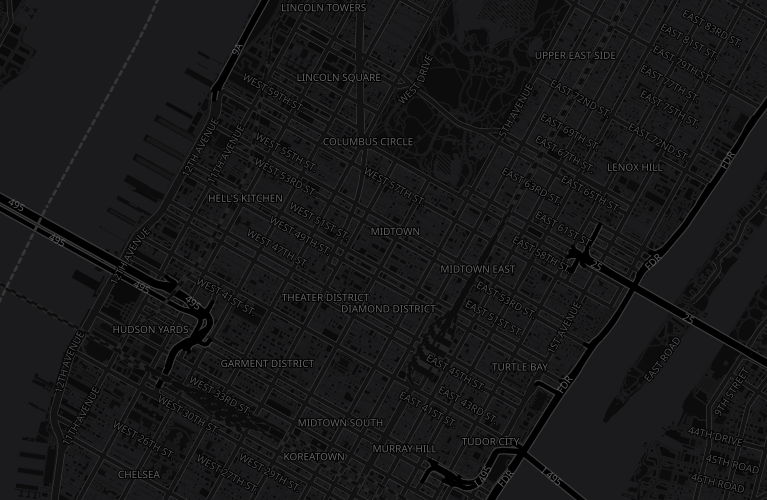

# OpenMapTiles

This repository contains a GeoServer data directory that will render OpenMapTiles maps using:
* MBTiles filled with Mapbox Vector Tiles as the source
* Well known [Maplibre GL styles](https://maplibre.org/maplibre-style-spec/) for the styling.

## GeoServer setup

In order to use this data directory you'll need:

1. A recent version of GeoServer.
2. The [MBStyles extension](https://docs.geoserver.org/stable/en/user/styling/mbstyle/installing.html), found from the release page of the chosen GeoServer version.
3. The [MBTiles store community module](https://docs.geoserver.org/stable/en/user/community/mbtiles/installing.html) (the mbtiles-store-plugin), found from the nightly builds of the same GeoServer series

For example, if the chosen GeoServer version is 2.26.1, then:
* Go to the download page of the 2.26.1 release, download the mbstyles extension, and unzip it in ``geoserver/WEB-INF/lib``
* Go to the [nightly builds for the 2.26.x series](https://build.geoserver.org/geoserver/2.26.x/community-latest/), download the mbtiles-store-plugin, and then unzip it in ``geoserver/WEB-INF/lib``
* Restart GeoServer for it to notice the plugins

## Data directory setup

The data directory in this repository contains the full configuration for GeoServer, but it lacks the source data and some fonts, as they are too big to be stored in this repository.

First, let's grab the source vector data. Download the [OpenMapTiles.com](https://openmaptiles.com/downloads/planet/) "OpenStreetMap vector tiles" file of the desired area (free only for non commercial usage).
Mind, the dataset for the whole world is north of 75GB.

Rename the downloaded file as ``maptiler-osm-planet.mbtiles`` and place it inside the ``data`` folder of this data directory.

Second, download the [Natural Earth II with Shaded Relief and Water
](https://www.dropbox.com/scl/fi/o6vj1qrsi7b9v7mu6tlf1/NE2_HR_LC_SR_W_COG.tif?rlkey=wgbd8yytqhdr8g5c7q5q74lry&st=dld4sb3e&dl=1) raster background we have already optimized for you, and also it inside the ``data`` folder of this data directory.

When done, the file system should look as follows:

Finally, some of these maps requires a rather rich set of fonts, to display labels in a variety of scripts. Download the [openmaptiles-fonts.zip](https://www.dropbox.com/scl/fi/nfrq0sd72cvz4jeqih8u8/openmaptiles-fonts.zip?rlkey=8tbq0nt6cjtpzzc36qs4ww6gh&st=ddit1d36&dl=1) and unpack its contents inside the ``styles`` folder of this data directory. 

When done, the file system should look as follows:

## Previewing the various maps

Once the above is done, start GeoServer and go for the layer preview.
You should see a number of layer groups:

Here is how each one would look, in the area of Manhattan, New York, USA.

 
*OSM Bright GL*

 
*Maptiler basic GL*

 
*Positron GL*

 
*Toner GL*

 
*Dark matter GL*
